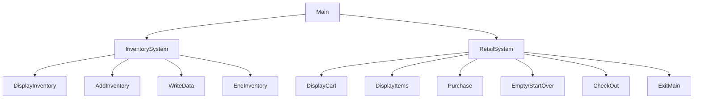

# Chapter-10-Team-Project
Rhett, Oliver
## <ACME_retail_system> Description
Here is where you describe what the program does:
Simulates an inventory control system and point of sale retail system. User has 3 menus. Main, Inventory(needs password), and Cash register

### <ACME_retail_system> Flowchart

#### Function Diagrams

| `Main`    |               |  author     |
| ------------------ | ------------- | ------------ |
| `argument:type`    | takes input from the user for N/A  |              |
| `time:integer`     | calculates input  | outputs Inventory or Retail            |
| `name:string`      | takes input for name N/A | returns total |
***
| `function name2`    |               |     author   |
| ------------------ | ------------- | ------------ |
| `argument:type`    | takes input from the user for ____  |              |
| `time:integer`     | calculates ______  | outputs ____             |
| `name:string`      | takes input for name ___ | returns total |
***
